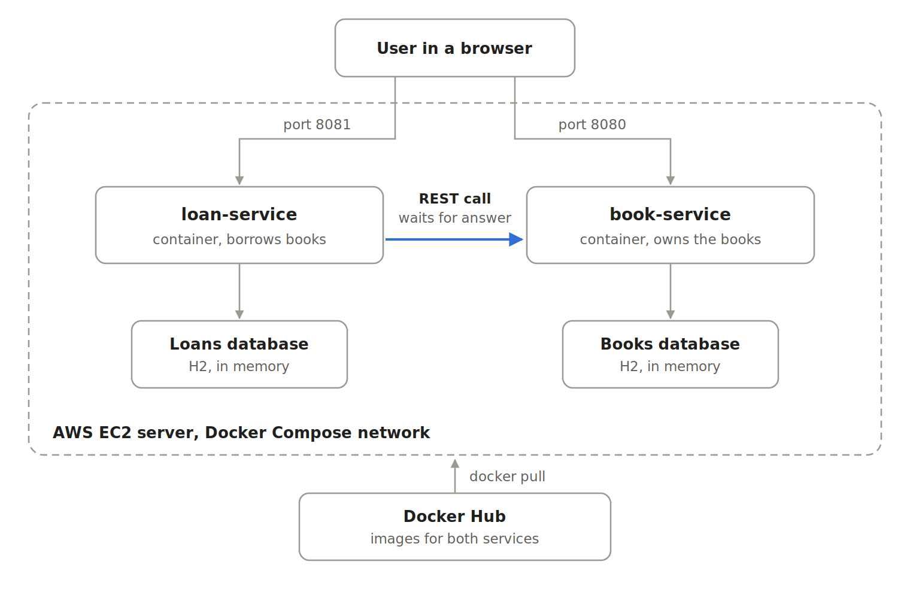

# Bookweb – microservices with Docker and AWS

Two Spring Boot microservices that run as Docker containers on AWS EC2.
loan-service calls book-service synchronously over REST before it saves a loan.

## Services
- **book-service** (port 8080): manages books
- **loan-service** (port 8081): borrows books, asks book-service first

## Run locally
docker compose up --build

## Images on Docker Hub
- bvijaylaxmi/bookweb-service:2.0
- bvijaylaxmi/loan-service:1.0
